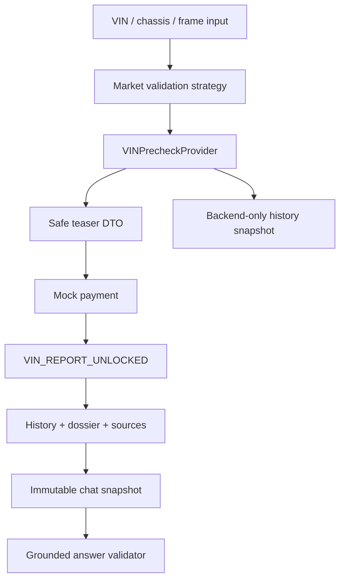
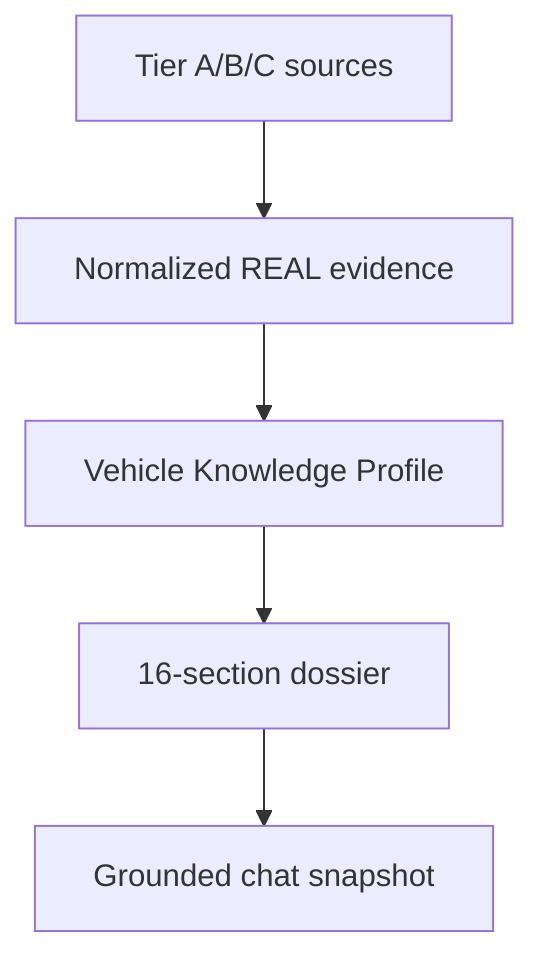
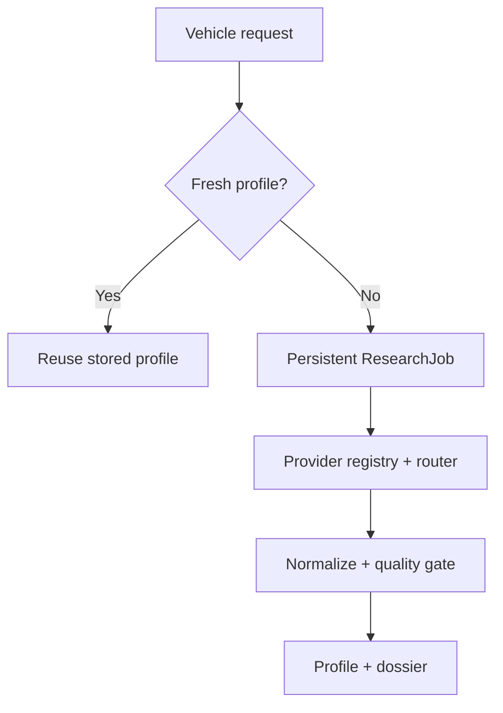
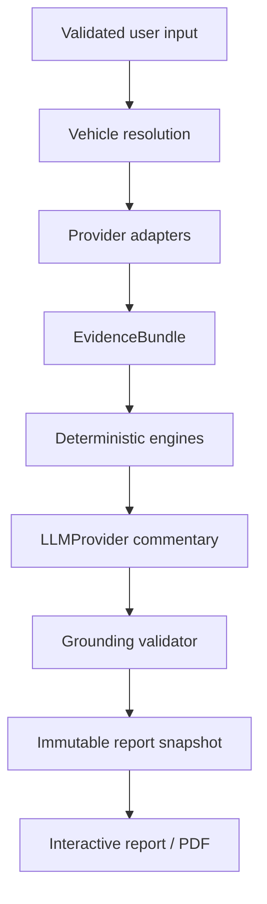

# Auto Expert 2.0 architecture

## Primary VIN pipeline

`VehicleKnowledgeProfile` is the central model identity. It links a resolved make, model,
generation, market, year, engine/code, transmission, drivetrain, body, and fuel to source
and evidence records plus freshness/version metadata.

The teaser DTO is a security boundary, not a visual blur over downloaded data. Before an
owner-scoped entitlement exists, the frontend never receives auction photos, sale prices,
damage details, exact odometer records, the full timeline, or the full history payload.

`VINPrecheckProvider` and `USVehicleDataProvider` isolate future paid/history sources and
official NHTSA/vPIC, recalls, complaints, and manufacturer-communication adapters. The
Stage 3 `NHTSAUSDataProvider` normalizes free official responses, uses a bounded 24-hour
cache, and returns `INSUFFICIENT_DATA` on transport or payload failures. Deterministic
fixtures remain available for automated tests.

## Real model evidence path

The first reviewed path is `Toyota / Camry / XV70 / USA / 2019 / A25A-FKS / 8AT`:

`data_origin=REAL|DEMO` is enforced on profiles, variants, sources, evidence, known
issues, owner materials, and VIN history. A combined test report may contain a real model
dossier and demo VIN history, but the two origins remain separate DTO fields and visible
UI labels. Confirmed evidence requires a linked active source; owner allegations never
become confirmed issues automatically.

## Automatic profile research

The USA route selects one active, lowest-cost provider for each required capability:
vPIC identity, NHTSA configuration labels, recalls, complaints, and manufacturer
communications. Each registry entry
declares markets, capabilities, cost model, lookup costs, key requirement, priority, and
data classes. Provider calls have finite retries, timeout, process-local rate control, and
a persistent 24-hour normalized/raw cache. An unavailable provider produces
`INSUFFICIENT_DATA`; no fixture is used as fallback.

`ResearchJob` persists `QUEUED`, `RUNNING`, `PARTIAL`, `COMPLETE`, or `FAILED` state,
provider steps, completed capabilities, errors, resolution ambiguity, timestamps, dossier
snapshot, and metrics. A fresh automatic profile is reused before routing, so repeat
requests issue no external calls. The Stage 3 seed and manifest are excluded from this
path and remain regression-only fixtures.

Identity resolution is two-phase. The first provider step decodes a USA VIN or confirms
the supplied make/model/year; only then does the router request capabilities that need a
resolved identity. `VehicleVariantResolver` uses provider candidates and treats a user
engine string only as a filter. Multiple supported candidates persist in the job and
produce an owner-scoped selection step; selecting one continues the same job from cache.

`VehicleIdentifierValidator` selects a strategy from market and identifier type. USA and
Canada require the North-American check digit. Korea, Europe, and China retain the
international 17-character format without applying that regional checksum. Japan also
accepts explicitly typed chassis/frame identifiers. Unsupported markets never fall
through to a USA provider.

## Preserved legacy expert pipeline

Provider protocols isolate technical data, local market listings, local costs, owner
materials, language-model generation, payments, and analytics. MVP implementations read
the internal database or provide deterministic development behavior. A future API adapter
implements the same protocol without changing the report pipeline.

## Trust boundary

The client sends only user input and authenticated requests. Source retrieval,
calculations, report generation, entitlement checks, and future API credentials remain on
the backend. Generated claims are validated against identifiers and statuses in the
snapshot. An `ESTIMATE` can never be upgraded to `CONFIRMED` by generated prose.

## Grounded Auto Expert Chat

An owner-scoped session is created only after a `VIN_REPORT_UNLOCKED` entitlement exists.
Its immutable snapshot contains the Vehicle Knowledge Profile, safe VIN summary, unlocked
history, dossier, known issues, owner-feedback aggregation, market analysis, local costs,
sources, evidence statuses, and language. A canonical SHA-256 digest detects mutation.

`ChatLLMProvider` receives only that snapshot and the conversation belonging to the same
session. The grounding validator rejects unknown source/evidence IDs, locked-history
claims, internal-payload markers, and status upgrades such as `ESTIMATE` to `CONFIRMED`.
The public session response contains messages and source attachments, never the snapshot
or backend history payload. The Stage 2 implementation is deterministic and makes no
external model request.

## Country and language separation

Country/region profiles affect listings, costs, roads, supply, and service context.
Language changes labels and commentary only. The same calculation snapshot feeds AZ, RU,
or EN presentation, preventing translated reports from changing technical conclusions.
